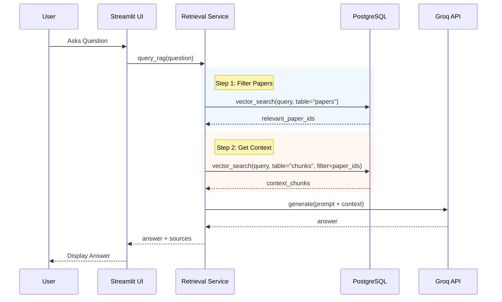

# System Architecture

## Overview

abstRAG utilizes a **Two-Step Retrieval-Augmented Generation** architecture designed to minimize hallucinations and maximize precision when dealing with dense academic texts.

## Core Components

### 1. The Retrieval Engine (Two-Step)

Standard RAG systems often fail on academic papers because they retrieve chunks from irrelevant papers that happen to share keywords. We solve this with a hierarchical approach:

*   **Step 1: Abstract-Level Filtering**
    *   **Input**: User query.
    *   **Process**: Semantic search against the embeddings of paper *abstracts*.
    *   **Output**: A set of Top-K candidate papers (e.g., top 10) that are thematically relevant.
    *   **Why?**: Abstracts are dense summaries. If the abstract matches the query, the paper is likely relevant.

*   **Step 2: Passage-Level Retrieval**
    *   **Input**: User query + ID list of candidate papers from Step 1.
    *   **Process**: Semantic search against the full-text chunks *only within* the candidate papers.
    *   **Output**: Top-N specific text passages (e.g., top 5 chunks).
    *   **Why?**: This constraints the search space, preventing the retrieval of "noise" chunks from irrelevant papers.

### 2. The Generation Engine

*   **Model**: Llama 3.1 8B (via Groq API).
*   **Prompting**: We use a strict prompt template that forces the model to answer *only* using the provided context.
*   **Citation**: The model is instructed to cite sources, which are then mapped back to the metadata for the UI display.

### 3. Data Storage (PostgreSQL + pgvector)

We use a unified PostgreSQL database for:
*   **Vector Storage**: Storing 768-dimensional embeddings for both abstracts and chunks using `pgvector`.
*   **Metadata**: Relational data (authors, dates, URLs).
*   **User Feedback**: Storing user upvotes/downvotes for future fine-tuning.

## Sequence Diagram

